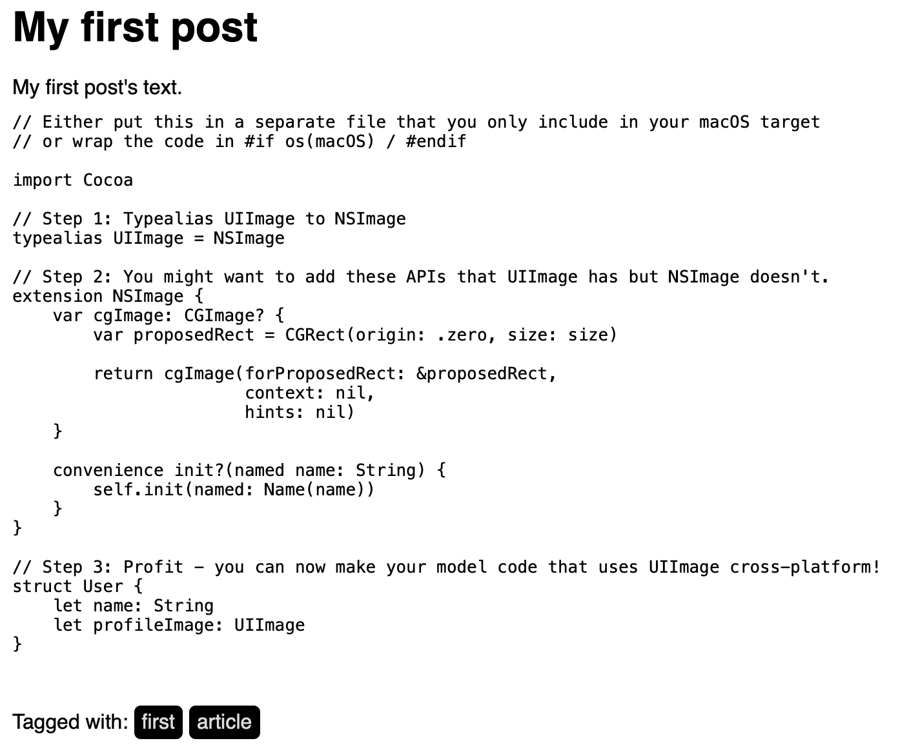
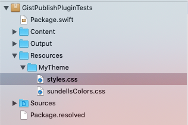
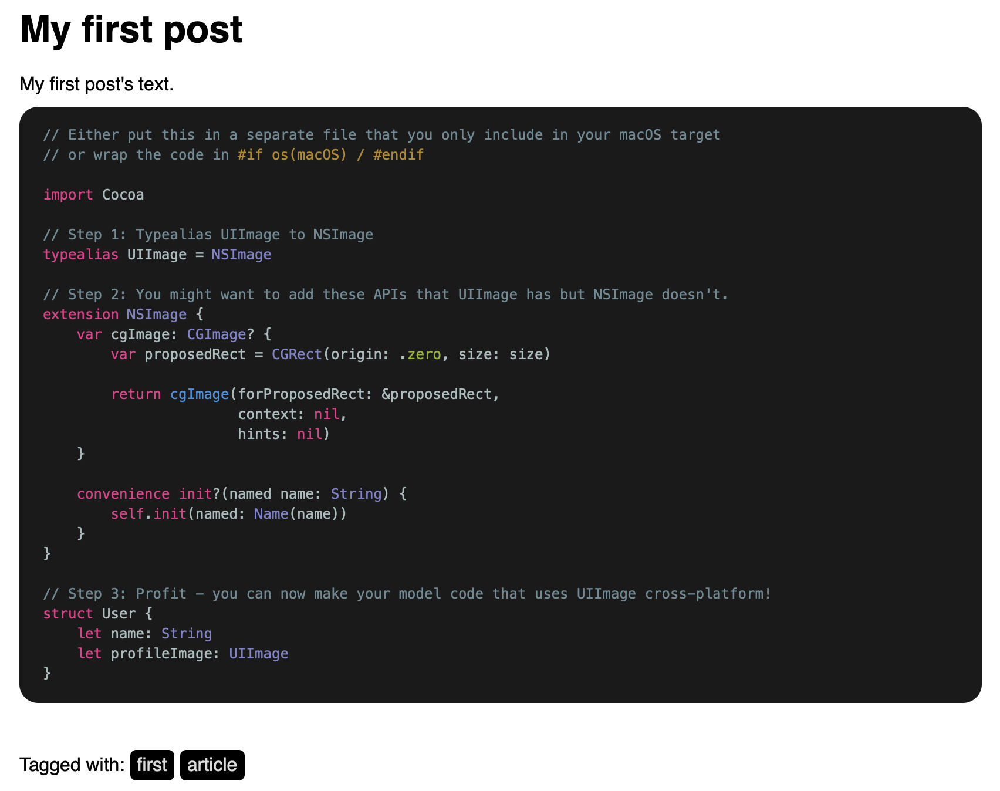

# GistPublishPlugin

A [Publish](https://github.com/johnsundell/publish) plugin which permits to embed Gist in your posts. 

Why ? 👉 It's possible to copy/paste the gist code directly in your Publish website in one of your post / page but if you want to centralize your snippet / examples of code in [Gist](https://gist.github.com) or mention a gist from someone else without have to copy it, it could help. When building again your Publish website (when adding a new post for example), the embedded gists will also be refreshed automatically with potential updates of code. It's also possible to embed the gist thanks to a `<script>` HTML entity but it's less flexible for rendering, theming etc.

## 📦 Installation

To install the plugin, add it as dependency in your `Package.swift` file:

```swift
let package = Package(
    ...
    dependencies: [
        ...
        .package(url: "https://github.com/thomaslupo/GistPublishPlugin", from: "0.1.0")
    ],
    targets: [
        .target(
            ...
            dependencies: [
                ...
                "GistPublishPlugin"
            ]
        )
    ]
    ...
)
```

Next, add the plugin at the publish step (in your `main.swift` file by default):

```swift
import GistPublishPlugin
...
try GistPublishPluginTests().publish(withTheme: .foundation, plugins: [.gist()])
```

## 🚀 Usage

To embed a gist in one of your post (or page etc.), use a blockquote in markdown, but add the "gist" prefix, like so:

```
> gist 05f837a3f901630e65e3652945424ba5
```

The suffix corresponds to the gist's unique identifier, available on the URL of the gist (https://gist.github.com/JohnSundell/05f837a3f901630e65e3652945424ba5)

By default, the gist will be added without any style. Let's add some style !

## 💎 Style

The plugin uses a default and basic gist renderer (embed the code in the `<pre><code></code></pre>` HTML entities) to be as flexible as possible with the syntax highlight, CSS attributes, colors etc.

It's possible to provide a custom renderer and use the `EmbeddedGist` entity and its properties to render the gist as you like.

For this example, let's use the [Splash](https://github.com/JohnSundell/Splash) package to create a custom renderer.

Add it as dependency in your `Package.swift` file:

```swift
let package = Package(
    ...
    dependencies: [
        ...
        .package(url: "https://github.com/JohnSundell/Splash", from: "0.14.0")
    ],
    targets: [
        .target(
            ...
            dependencies: [
                ...
                "Splash"
            ]
        )
    ]
    ...
)
```

Create a custom renderer which uses `Splash`:

```swift
import Splash 

class MyGistRenderer: GistRenderer {
    func render(gist: EmbeddedGist) throws -> String {
        let highlighter = SyntaxHighlighter(format: HTMLOutputFormat())
        return gist.files.map { file in
            return "<pre><code>" + highlighter.highlight(file.content) + "</pre></code>"
        }.joined(separator: "")
    }
}
```

Specify this custom renderer when declaring the GistPublishPlugin: 

```swift
try GistPublishPluginTests().publish(withTheme: .foundation,
                                     plugins: [.gist(renderer: MyGistRenderer())])
```

Cool ! Let's reload the post's web page and ... uh, still ugly ?



Yes, the Splash plugin has added all the correct HTML entities and CSS classes (like `<span class="keyword">import</span>`).

The final step is to add an associated CSS style. We're going to use this one, provided by John Sundell on the Splash documentation: https://github.com/JohnSundell/Splash/blob/master/Examples/sundellsColors.css.

To do this, I usually create a custom `Theme` for my Publish website. 

In the `Resources` directory of your Publish project, we can create a subfolder `MyTheme`, add it a copy of the default Publish CSS Style available in the Publish package (`Publish/Resources/FoundationTheme/styles.css`) and the `sundellsColors.css` file.



For the `Theme`, we can create a copy of the `Theme+Foundation` (`Publish/Sources/Publish/API/Theme+Foundation.swift`) in a `Theme+MyTheme.swift` file, just `import Publish` and add these naming updates:

```swift
import Publish
import Plot

public extension Theme {
    /// The default "Foundation" theme that Publish ships with, a very
    /// basic theme mostly implemented for demonstration purposes.
    static var myTheme: Self {
        Theme(
            htmlFactory: MyThemeHTMLFactory(),
            resourcePaths: [
                "Resources/MyTheme/styles.css",
                "Resources/MyTheme/sundellsColors.css"
            ]
        )
    }
}

private struct MyThemeHTMLFactory<Site: Website>: HTMLFactory {
  ...
}
```

We have to include our `sundellsColors.css` file on the HTML pages including some gist. Let's update the `head` in the `makeItemHTML` function:

```swift
func makeItemHTML(for item: Item<Site>,
                      context: PublishingContext<Site>) throws -> HTML {
        HTML(
            ...
            .head(for: item,
                  on: context.site,
                  stylesheetPaths: ["/styles.css", "/sundellsColors.css"]),
            ...
        )
    }
```

The last thing to do is to specify our new amazing theme when publishing our website:

```swift
try GistPublishPluginTests().publish(withTheme: .myTheme,
                                     plugins: [.gist(renderer: MyGistRenderer())])
```

Let's reload again and ... voilà !



## 🛠 Demo

A [Publish Demo](https://github.com/thomaslupo/GistPublishPluginTests) project is available to test the integration of the GistPublishPlugin.

## 🙏🏼 Source of inspiration

The [TwitterPublishPlugin](https://github.com/insidegui/TwitterPublishPlugin) was a great source of inspiration for fetching gist from the GitHub API (like the fetch of a Tweet in the TwitterPublishPlugin), rendering it and so on.

The [Splash Swift package](https://github.com/JohnSundell/Splash) and the [Splash Publish Plugin](https://github.com/JohnSundell/SplashPublishPlugin) were very helpful too.
